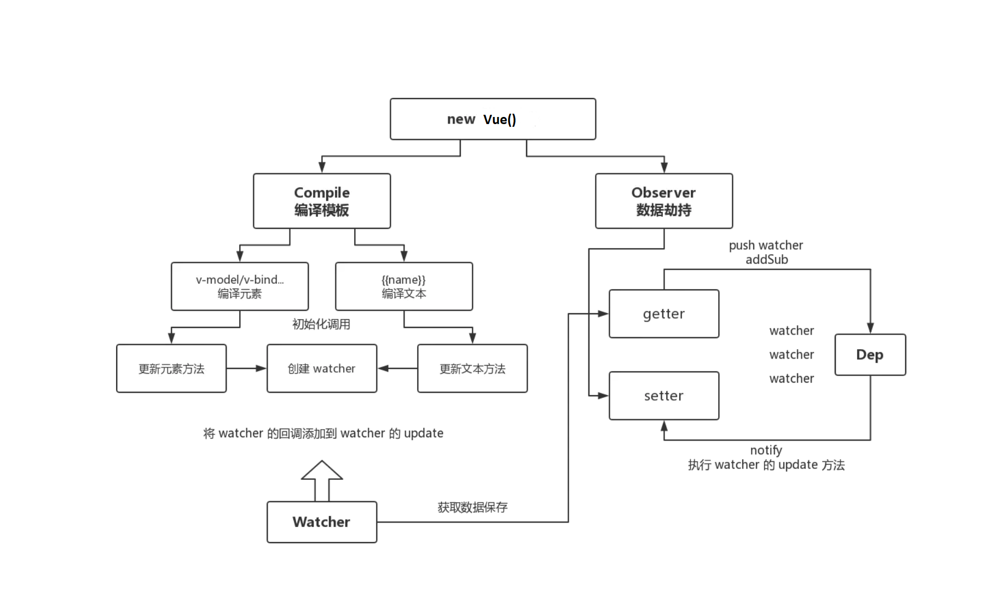

# 模拟Vue响应式原理

## 开始之前准备知识

### 数据响应式核心原理

#### Vue2版:

参考资料:

- [Vue2.x深入响应式原理](https://cn.vuejs.org/v2/guide/reactivity.html)
- [MDN-Object.defineProperty](https://developer.mozilla.org/en-US/docs/Web/JavaScript/Reference/Global_Objects/Object/defineProperty)
- 浏览器兼容IE8以上(不兼容IE8)

```html
<!DOCTYPE html>
<html>
<head>
    <meta charset="UTF-8">
    <meta name="viewport" content="width=device-width, initial-scale=1.0">
    <meta http-equiv="X-UA-Compatible" content="ie=edge">
    <title>defineProperty</title>
</head>
<body>
    <div id="app">hello</div>
    <script>
        // 模拟 Vue 中的 data 选项
        let data = {
            msg: 'hello'
        }

        // 模拟 Vue 的实例
        let vm = {};

        // 数据劫持：当访问或者设置 vm 中的成员的时候，做一些干预操作
        Object.defineProperty(vm, 'msg', {
            // 可枚举（可遍历）
            enumerable: true,
            // 可配置（可以使用 delete 删除，可以通过 defineProperty 重新定义）
            configurable: true,
            // 当获取值的时候执行
            get () {
                console.log('get: ', data.msg);
                return data.msg;
            },
            // 当设置值的时候执行
            set (newValue) {
                console.log('set: ', newValue);
                if (newValue === data.msg) return;
                data.msg = newValue;
                // 数据更改，更新 DOM 的值
                document.querySelector('#app').textContent = data.msg;
            }
        })

        // 测试
        vm.msg = 'Hello World';
        console.log(vm.msg);
    </script>
</body>
</html>
```


#### Vue3版:

参考资料:

- [MDN-Proxy](https://developer.mozilla.org/en-US/docs/Web/JavaScript/Reference/Global_Objects/Proxy)
- 直接监听对象，而非属性
- ES6中新增，IE不支持，性能由浏览器优化

```html
<!DOCTYPE html>
<html>
<head>
    <meta charset="UTF-8">
    <meta name="viewport" content="width=device-width, initial-scale=1.0">
    <meta http-equiv="X-UA-Compatible" content="ie=edge">
    <title>Proxy</title>
</head>
<body>
    <div id="app">hello</div>
    <script>
        // 模拟 Vue 中的 data 选项
        let data = {
            msg: 'hello',
            count: 0
        }

        // 模拟 Vue 实例
        let vm = new Proxy(data, {
            // 执行代理行为的函数
            // 当访问 vm 的成员会执行
            get (target, key) {
                console.log('get, key: ', key, target[key]);
                return target[key];
            },
            // 当设置 vm 的成员会执行
            set (target, key, newValue) {
                console.log('set, key: ', key, newValue);
                if (target[key] === newValue) return;
                target[key] = newValue;
                document.querySelector('#app').textContent = target[key];
            }
        })

        // 测试
        vm.msg = 'Hello World';
        console.log(vm.msg);
    </script>
</body>
</html>
```


### 发布-订阅模式

发布-订阅模式其实是一种对象间一对多的依赖关系，当一个对象的状态发送改变时，所有依赖于它的对象都将得到状态改变的通知。

订阅者（Subscriber）把自己想订阅的事件注册（Subscribe）到调度中心（Event Channel），当发布者（Publisher）发布该事件（Publish Event）到调度中心，也就是该事件触发时，由调度中心统一调度（Fire Event）订阅者注册到调度中心的处理代码。

```javascript
// 事件触发器
class EventEmitter {
    constructor () {
    	this.subs = Object.create(null);
    }

    // 注册事件
    $on (eventType, handler) {
        this.subs[eventType] = this.subs[eventType] || [];
        this.subs[eventType].push(handler);
    }

    // 触发事件
    $emit (eventType) {
        if (this.subs[eventType]) {
            this.subs[eventType].forEach(handler => {
                handler();
            })
        }
    }
}

// 测试
let em = new EventEmitter();
em.$on('click', () => {
    console.log('click1');
})
em.$on('click', () => {
    console.log('click2');
})

em.$emit('click');
```


### 观察者模式

定义对象间的一种一对多的依赖关系，当一个对象的状态发生改变时，所有依赖于它的对象都得到通知并被自动更新。

```javascript
// 发布者-目标
class Dep {
    constructor () {
        // 记录所有的订阅者
        this.subs = [];
    }
    
    // 添加订阅者
    addSub (sub) {
        if (sub && sub.update) {
            this.subs.push(sub);
        }
    }
    
    // 发布通知
    notify () {
        this.subs.forEach(sub => {
            sub.update();
        })
    }
}

// 订阅者-观察者
class Watcher {
    update () {
        console.log('update');
    }
}

// 测试
let dep = new Dep();
let watcher = new Watcher();

dep.addSub(watcher);
dep.notify();
```


## 模拟Vue响应式

在 Vue 的 MVVM 设计中，主要针对 `Compiler`（模板编译）、`Observer`（数据劫持）、`Watcher`（数据监听）和 `Dep`（发布订阅）几个部分来实现，核心逻辑流程可参照下图：



#### Vue类的实现：

```javascript
class Vue {
    constructor(options) {
        //通过属性保存选项的数据
        this.$options = options || {};
        this.$data = options.data || {};
        this.$el = typeof options.el === 'string' ? document.querySelector(options.el) : options.el;

        //把data中的成员转换成getter和setter，注入到vue实例中
        this._proxyData(this.$data);
        //调用onserver对象，监听对象的变化
        new Observer(this.$data);
        //调用compiler对象，解析指令和差值表达式
        new Compiler(this);
    }

    _proxyData(data) {
        //遍历data中的所有属性
        Object.keys(data).forEach(key => {
            //把data的属性注入到vue实例中
            Object.defineProperty(this, key, {
                enumerable: true,
                configurable: true,
                get () {
                    return data[key];
                },
                set (newValue) {
                    if(newValue === data[key]) return;
                    data[key] = newValue;
                }
            })
        })
    }
}
```


#### Compiler(模板编译)类的实现：

```javascript
class Compiler{
    constructor(vm){
        this.el = vm.$el;
        this.vm = vm;
        this.compile(this.el);
    }

    //编译模板，处理文本节点和元素节点
    compile (el) {
        let childNodes = el.childNodes;
        Array.from(childNodes).forEach(node => {
            //处理文本节点
            if(this.isTextNode(node)){
                this.compileText(node)
            }

            //处理元素节点
            if(this.isElementNode(node)){
                this.compileElement(node);
            }

            //判断node节点是否有子节点，有则递归调用complie
            if(node.childNodes && node.childNodes.length) this.compile(node);
        })
    }

    //编译元素节点，处理指令
    compileElement(node){
        Array.from(node.attributes).forEach(attr => {
            //判断是否是指令
            let attrName = attr.name;
            if(this.isDirective(attrName)) {
                attrName = attrName.substr(2);
                let key = attr.value;
                
                //判断是否是事件指令
                if(this.isEventDirective(attrName)){
                    //事件指令
                    this.eventHandler(node, this.vm, key, attrName);
                }else{
                    //普通指令
                    this.update(node, key, attrName)
                }
            }
        })
    }

    //编译文本节点，处理差值表达式
    compileText(node){
        let reg = /\{\{(.+?)\}\}/;
        let value = node.textContent
        if (reg.test(value)) {
            let key = RegExp.$1.trim();
            node.textContent = value.replace(reg, this.vm[key]);

            // 创建watcher对象，当数据改变更新视图
            new Watcher(this.vm, key, (newValue) => {
                node.textContent = newValue;
            })
        }
    }

    update (node, key, attrName) {
        let updateFn = this[attrName + 'Updater'];
        updateFn && updateFn.call(this, node, this.vm[key], key);
    }

    // 处理 v-text 指令
    textUpdater (node, value, key) {
        node.textContent = value;

        //创建watcher对象
        new Watcher(this.vm, key, (newValue) => {
            node.textContent = newValue;
        });
    }

    // 处理 v-model 指令
    modelUpdater (node, value, key) {
        node.value = value;
        //创建watcher
        new Watcher(this.vm, key, (newValue) => {
            node.value = newValue;
        });
        // 双向绑定
        node.addEventListener('input', () => {
            this.vm[key] = node.value;
        })
    }

    // 处理 v-html 指令
    htmlUpdater (node, value) {
        node.innerHTML = typeof value == 'undefined' ? '' : value;
    }

    // 处理 v-on 指令
    eventHandler (node, vm, key, dir) {
        let eventType = dir.split(':')[1];
        let fn = vm.$options.methods && vm.$options.methods[key];

        if (eventType && fn) {
            node.addEventListener(eventType, fn.bind(vm), false);
        }
    }

    //判断元素是否是指令
    isDirective(attrName){
        return attrName.startsWith('v-');
    }

    //判断节点是否是文本节点
    isTextNode(node){
        return node.nodeType === 3;
    }

    //判断是否是元素节点
    isElementNode(node){
        return node.nodeType === 1;
    }

    //判断是否是事件节点
    isEventDirective(dir){
        return dir.indexOf('on') === 0;
    }
}
```


#### Obersver(数据劫持)类的实现：

```javascript
class Observer {
    constructor(data) {
        this.walk(data);
    }

    walk (data) {
        //判断data是否是对象
        if(!data || typeof data !== 'object') return;

        //遍历data对象的所有属性
        Object.keys(data).forEach(key => {
            this.defineReactive(data, key, data[key]);
        })
    }

    defineReactive (obj, key, val) {
        let that = this;
        //创建dep对象
        let dep = new Dep();
        this.walk(val);

        Object.defineProperty(obj, key, {
            enumerable: true,
            configurable: true,
            get () {
                //收集dep依赖
                Dep.target && dep.addSub(Dep.target);
                return val;
            },
            set (newValue) {
                if(newValue === val) return;
                val =newValue;
                that.walk(newValue);

                //发送通知
                dep.notify();
            }
        })
    }
}
```


#### 观察者Watcher(数据监听)类的实现：

```javascript
class Watcher{
    constructor(vm, key, cb){
        this.vm = vm;
        //data中的属性名
        this.key = key;
        //回调函数
        this.cb = cb;

        //把watcher对象记录到Dev的静态属性target中
        Dep.target = this;

        this.oldValue = vm[key];

        //防止重复触发
        Dep.target = null;
    }

    //当数据发生变化时更新
    update(){
        let newValue = this.vm[this.key];
        //如果新旧数据相同，不做操作
        if(newValue === this.oldValue) return;

        this.cb(newValue);
    }
}
```


#### Dep(发布订阅)类的实现：

```javascript
class Dep{
    constructor(){
        //存储所有观察者
        this.subs = [];
    }

    //添加观察者
    addSub(sub){
        if(sub && sub.update) this.subs.push(sub);
    }

    //发送通知
    notify(){
        this.subs.forEach(sub => {
            sub.update();
        })
    }
}
```

## 总结：

到此为止，模拟实现vue就完成了，还有部分vue指令阔以继续增加完善，完善的项目仓库地址：

